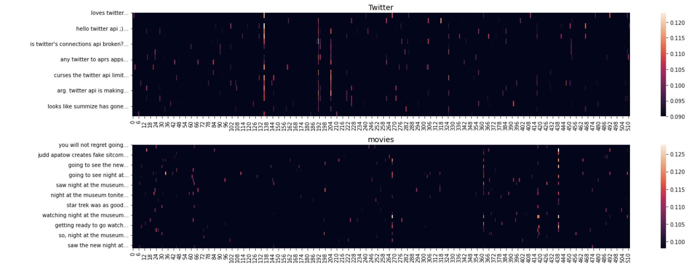
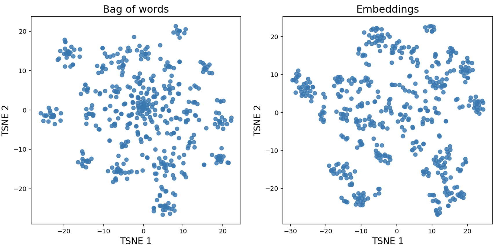
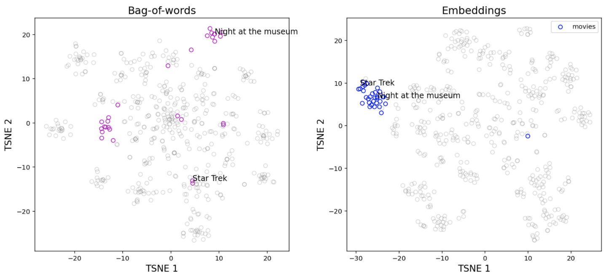
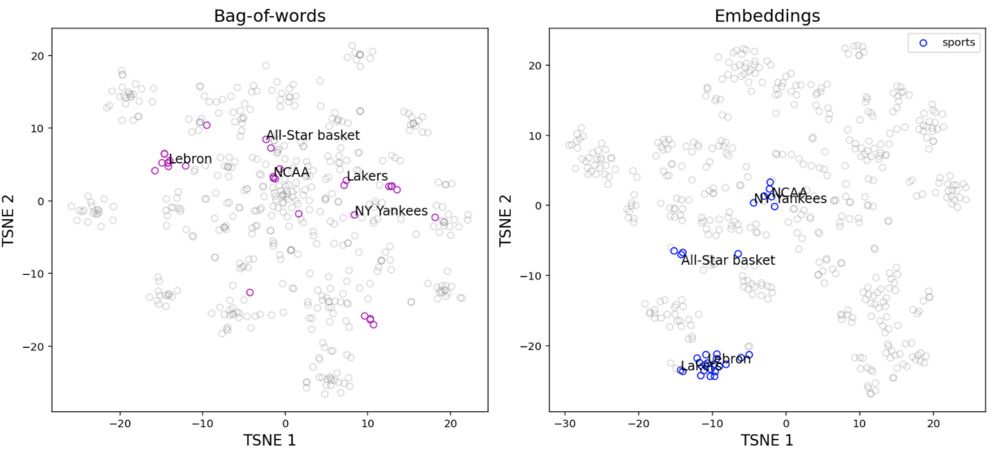
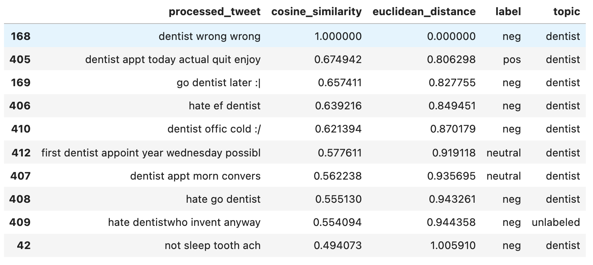
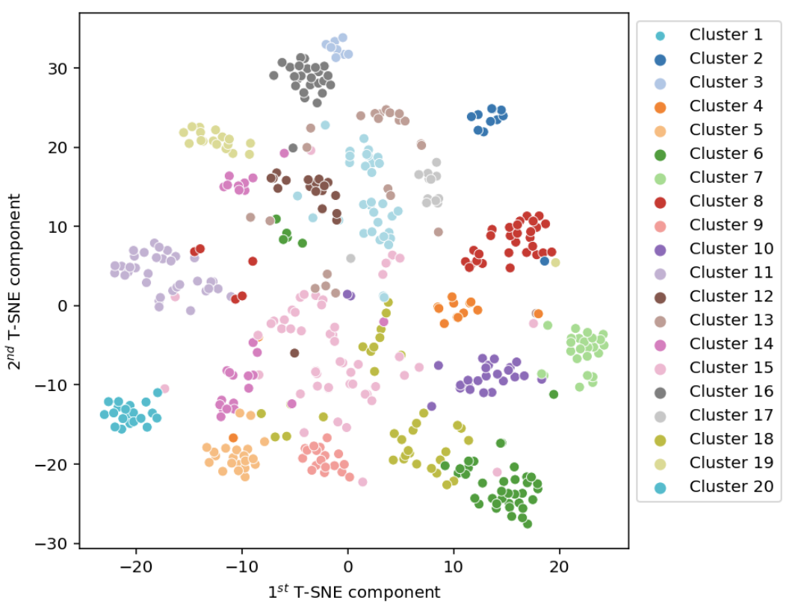
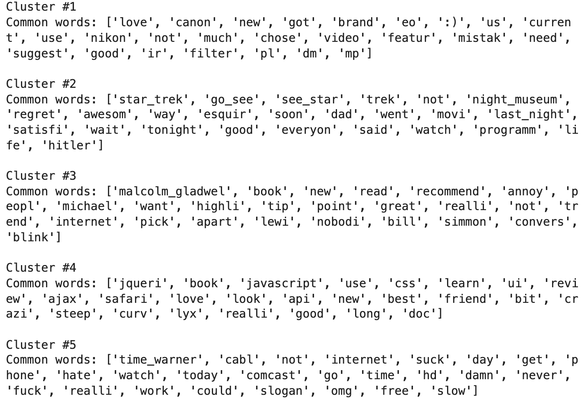

# Text similarity and clustering

### Feature extraction from text data

There are several [techniques](https://scikit-learn.org/stable/modules/feature_extraction.html#text-feature-extraction) for extracting features from text. In this notebook, I used the following methods:

* Bag of words, where the numbers in the vectors representing each text sample correspond to word frequencies.
* Tf-idf, where the numbers in the vectors representing each text sample correspond to word counts, re-weighted by the inverse document frequency.
* Pretrained sentence embeddings ([Universal Sentence Encoder model from Tensorflow-Hub](https://tfhub.dev/google/universal-sentence-encoder/4)) which are are learned from the data using an "embedding method" in such a way that they encode semantic relationships.  Similar texts have similar embeddings.

###  Intensity of text embeddings for selected topics

Examples of text embeddings intensities for selected topics. We see that the "activated" embeddings differ among tweets of different topics.

### T-SNE biplots

Plots of vector representations of texts created with bag of words and pretrained sentence embeddings. We can see the formation of "clusters" of documents. (Each point in these plots represents a tweet.)

Below, I'm color-coding data points (i.e. tweets) according to the topic they belong to. Using sentence embeddings here has grouped tweets of the same topic, even if they don't always use the exact words or terms. For example, we see that the sentence embeddings could detect similarities between, e.g. “Night at the museum” and “Star Trek” and then put them close to each other in the plot.

### Text similarity

Example of text similarity detection, using the cosine similarity and the euclidean distance.

### Document clustering using K-Means

Example of document clustering using k-means.

